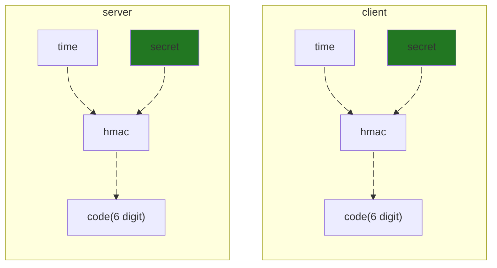

# 利用 AI 輔助學習

那些以前攻克不了的問題，都將成為可能

---

# 契機

### 換個方式使用 AI

社群媒體渲染下的 AI 都是以完成任務為導向的，但利用 AI 來輔助學習的成效如何一直都是個很少人提及的，因此想要嘗試看看能不能用 AI 來幫助我學習

### 解決以往學習的困境

趁這個機會來解決以往學習的三大困境

- 邊際效益遞減
- 你不親自動手永遠無法理解
- 只差一步就成功了(超困難的一步)

---

# 實驗的設計 🧪
開始之前先有個目標

實驗主要針對那些平常看到覺得有趣但一直都沒認真去理解的事物，以往看待這種問題都會以幾種方式被忽略掉

- 對當下執行的任務沒什麼直接幫助
- 隨便找個文件看看就結束了
- 部分知識儲備不足，導致無法進行下去
- 我應該不需要知道這個

這次會使用 OCaml 作為主要實作的語言，與 Codex 對話直到內容足夠完整且理解為止

---
layout: image-right

# the image source
image: ./assets/totp.png
backgroundSize: contain
---

# 舉個例子 🌰

TOTP

心中產生無數個疑問

- 六位數字怎麼生成的？
- 為什麼是六位數字？
- 為什麼是 30 秒更新一次？
- Server 怎麼驗證這串數字？
- 首次開啟兩步驟驗證掃的 QR Code 是什麼
- 如果是根據時間變換的話，那 Server 的時間不一致怎麼辦？
- ...

---

# TOTP

---
layout: center
---

# 學習的瓶頸

懶惰與拖延是萬惡之源 AI 如何幫助我突破困境

---
layout: image-right
image: ./assets/chart.png
backgroundSize: contain
---

# 邊際效益遞減 📉

#### 一門知識的學習會隨著時間跟經驗逐漸累積，但增長的速度卻會逐漸變慢，甚至停滯不前，理解一小部分需要越來越多的知識儲備，耗費的時間與精力更是以指數成長

AI 的強項之一，大量的知識，重點是能夠從一個問題中持續延伸，直到能夠完整解決這個問題為止，讓我能在實作中完整知道需要哪些知識，讓我對整個事物有全盤的理解，這是以往自己單純的網路搜尋很難達成的。

---

# 你不親自動手永遠無法理解 🔬

#### 大部分知識讀讀文件只是淺嚐，嘗試理解也僅僅是略懂，自己動手做才是有機會在腦子裡留下刻印，決定要不要開始動手取通常決於夠不夠想理解，或是不想做一半因為太難而放棄，這現象會形成一種阻力，讓自己對動手實做產生一種恐懼

有 AI 協助的情況下會讓你比較有信心去嘗試，假如真的糟糕透頂大不了直接叫 AI 幫你生出來你再慢慢讀就好，不至於到爛尾的程度。

遺忘是一定的，但期望不要忘得像是當作沒這件事發生一樣，自己實作的意義並不在於完成一個偉大的作品，而是通透的理解整個脈絡，細節會隨時間丟失，但這無傷大雅，因為能利用脈絡把剩下的找回來。

---

# 只差臨門一腳 💡

#### 常常有個狀況是你好不容易掌握了絕大部分的知識了，卻在一個理論上卡住，好死不死這還是最關鍵的部分，這下尷尬了，想弄懂不知道要奮鬥到哪時，不得已只好暫時擱置，這搞的自己處在似懂非懂的狀態，而且這種破碎的知識忘的速度比起一般完整的知識還要快的多。

在 AI 輔助下會更積極的想辦法去理解，問到飽、找資源、換說法、示範給我看，各種的方法都想辦法試一遍，不會一拖再拖。這更多體現在心態層面，因為知道 AI 會回答我，即便不是完全正確，也能從這些回答中找到線索，慢慢的把知識組織起來，直到能夠真正理解為止。

---

# 就只有對話 💬

#### 整個過程並未用任何 AI 的衍生工具，完全就是對話，也幾乎沒有讓 AI 直接操控我的專案，一方面是因為我本身不喜歡被干擾思考，另一方面是以學習為目的動手的應該是學習者，我要的是把 AI 的經驗帶走，而不是直接獲取成果。

不過在對話中我有自己的行為準則

- 質疑所有我看到的回覆
- 過程中任何在心中冒出的疑問都問清楚
- 搞清楚 AI 提供的方法背後動機跟原因是什麼

---

# 請 AI 用工具驗證測試 🧰

### AI 能幫我生一些測試，能夠通過，但是這些測試本身是正確的嗎？

用其他語言現成的工具自己驗證輸入輸出是一種辦法

但程式要自己寫，輸出資料格式都不太相同要仔細對照，叫 AI 寫會掉入另一個陷阱理，你怎麼知道他寫的這個程式結果是你要對照的結果，難道要叫它再寫一個程式來驗證這個程式嗎？

#### 其實不必這麼麻煩

AI 才是最懂得有什麼工具可以使用的，直接讓它自己用工具生成輸入輸出我自己對照，或是請他提供出處我自己去校驗。

---
layout: intro
---

# 為什麼是 OCaml 🐫

長年不在排行榜第一頁的語言怎麼有人要用？

<v-switch>
  <template #1> 我喜歡 </template>
  <template #2>
    生態足夠差，這迫使我必須完全的靠自己，沒有什麼現成的資源可以參考。
  </template>
  <template #3>AI 在熱門語言表現的很好，我倒想看看 OCaml 寫的如何</template>
</v-switch>

---
layout: center
---

# 假如是個熱門語言專案 🔥

如果是 Typescript、Python？

生態好的語言很多事情可以偷吃步，現成的套件應有盡有，去閱讀原始碼來彌補並不是不行，而是這些現成的函式庫是被精心設計過的，高度的抽象，本身與主體不相關的雜訊很多，這時候去分析追蹤內容反而效果並不好，你不清楚它背後的動機跟設計理念，反而會讓你對整個事物的理解變得不利。

---
layout: fact
---

# Thank You
[ocaml-lab](https://github.com/FizzyElt/ocaml-lab)