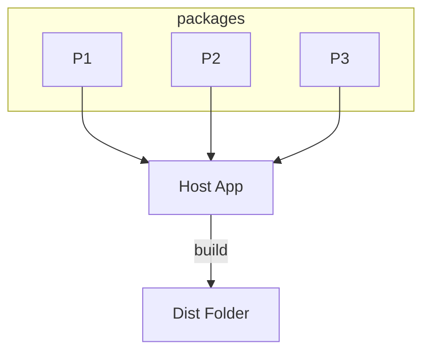
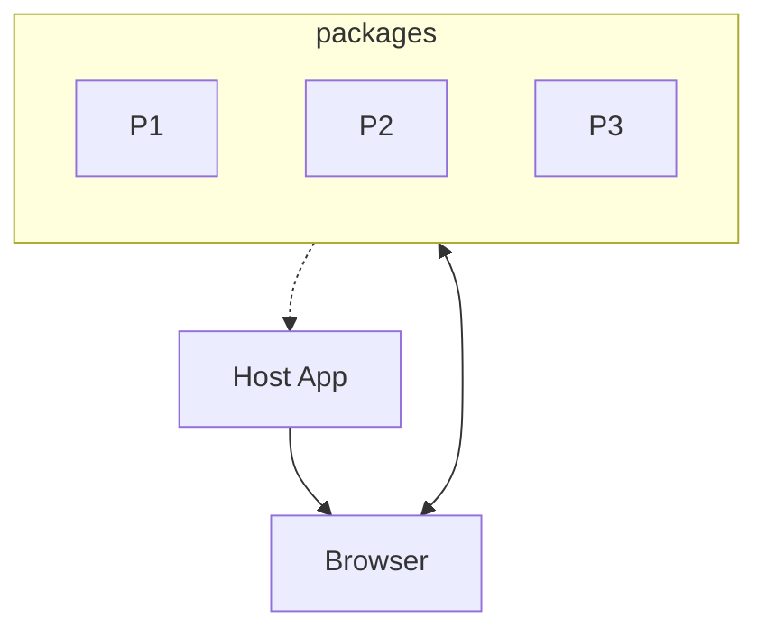
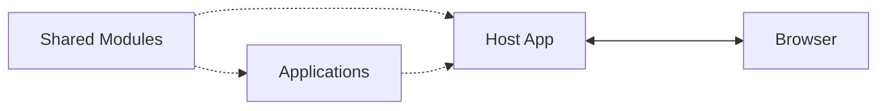
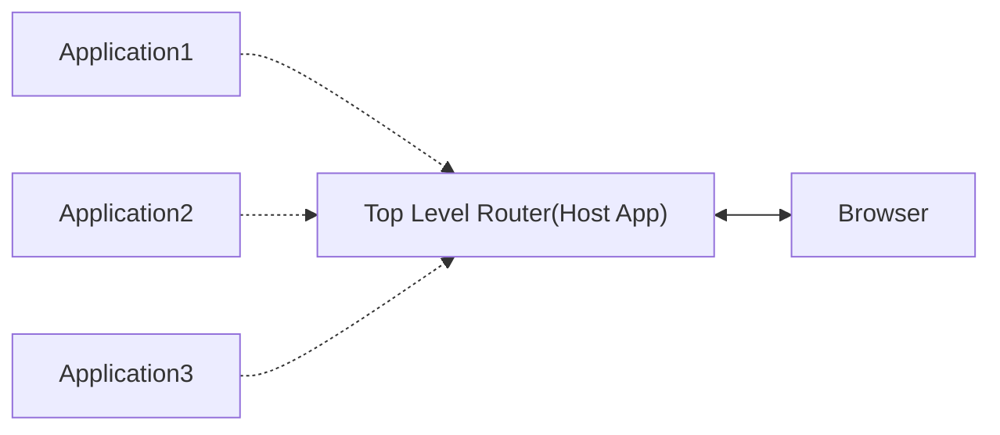
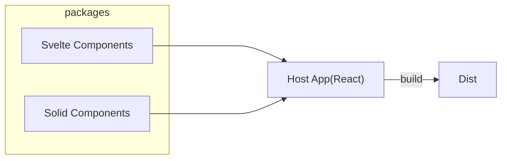

# Micro Front-End 導論

Micro Front-End 定義及作法

---

# 目錄

- 研究目標
- 前端架構的演進
- Micro Front-End 定義
- Micro Front-End 的實作種類
- 我們真的需要 Micro Front-End 嗎？
- 單一專案多框架融合可能性（以 React、Svelte、Solid 為例）

---
layout: center
---

# 研究目標

- 理解 Micro Front-End 基本構想，同時了解其優缺點
- 平滑遷移現有專案至新框架，Micro Front-End 是否是解方？

---
layout: cover
---

# 前端架構的演進

Monolith -> Modular Monolith -> Monorepo

---
layout: image-right
image: /assets/monolith.png
backgroundSize: contain
---

# Monolith (單體式)

- 與後端共存
- 通常由後端模版語法生成
- 前端多為附屬品（為後端提供介面操作）
- 與使用者互動性較低

---
layout: image-right
image: /assets/modular-monolith.png
backgroundSize: contain
---

# Modular Monolith (模組化單體式)

- 前端與後端分離
- 整體專案再被細化成多個模組（重複的功能行為及元件）
- 關注點著重於更複雜的互動、系統化的組織樣式、狀態管理及變化
- 多以 SPA 方式運作

---
layout: image-right
image: /assets/monorepo.png
backgroundSize: contain
---

# Monorepo

- 將能夠獨立運作的部分再拆分作個別管理
- 每個部分可獨立開發、測試
- 多團隊共同開發同一專案時可能使用的形式

在開發單一複雜的產品的情境下，重點在多團隊協作要盡可能降低彼此間的影響，所以如何解偶合、定義清楚的介面是關鍵，否則幾乎得不到任何好處

備註：Application 在這裡通常表示能夠獨立運作的商業邏輯區塊

---
layout: center
---

# Micro Front-End

既陌生又高大尚的名詞

---
layout: center
---

# Micro Front-End 的疑問

- Micro Front-End 從何而來？
- Micro Front-End 的定義是什麼？
- Micro Front-End 主要解決什麼問題？

---

# Micro Front-End

1. Micro Front-End 從何而來？

由 Microservices 啟發而來，用同樣的想法套用在前端

2. Micro Front-End 的定義是什麼？

通常指的是將前端拆分成多個獨立的部分，各自能夠獨立**開發、測試、部署**

3. Micro Front-End 主要解決什麼問題？

與 Microservices 相同，將專案從商業邏輯面切分成各個獨立的部分，方便多團隊協作開發及維護

---
layout: two-cols-header
---

# Micro Front-End 的實作種類

::left::

## Buildtime Integration



::right::

## Runtime Integration



---
layout: image-right

image: /assets/buildtime-integration.png
backgroundSize: contain

---

# Buildtime Integration

- 各個部分以 Package 形式存在
- Host App 引入並使用這些 Package
- Host App 負責打包成最終產物

達成 Micro Front-End 的三個條件
- 獨立開發：各個 Package 可專注於自己的功能開發
- 獨立測試：各個 Package 可獨立對自己的部分測試
- 獨立部署：以模組的方式發布給 Host App 引用

---
layout: image-right

image: /assets/runtime-integration.png
backgroundSize: contain

---

# Runtime Integration

- 各個部分以 Package 形式存在
- Package 單獨被發布在伺服器上（CDN）
- Host App 在使用者端會動態載入這些 Package

達成 Micro Front-End 的三個條件
- 獨立開發：各個 Package 可專注於自己的功能開發
- 獨立測試：各個 Package 可獨立對自己的部分測試
- 獨立部署：獨立部屬各個 Package 到線上伺服器上

目前純前端支援的相關工具有 Module Federation、Single SPA

---
layout: center
---

# 兩者的差異

| 特性       | Buildtime Integration | Runtime Integration |
| ---------- | :-------------------: | :-----------------: |
| 開發複雜度 |          低           |         高          |
| 開發體驗   |         普通          |         差          |
| 部署複雜度 |          低           |         高          |
| 載入速度   |          高           |         低          |
| 即時更新   |         不行          |        可以         |

---
layout: center
---

# Module-federation & Single-spa

---

# Module Federation

***

主要解決 Micro Front-End 解偶應用的同時，多個應用需共享相同套件的問題，與 Micro Front-End 無直接關聯，且並非所有 bundle tool 都支援。

> Module Federation 是一種 JavaScript 應用分治的架構模式（類似於服務端的微服務），它允許你在多個 JavaScript 應用程式（或微前端）之間共享程式和資源。

[What is Module Federation ?](https://module-federation.io/guide/start/index.html#-what-is-module-federation)



---

# Single-spa

***

[single-spa](https://single-spa.js.org/docs/getting-started-overview) 是一種頂層路由。當路由處於活動狀態時，它將下載並執行該路由的相關程式。

路由的程式被稱為應用，每個程式都可以（可選）擁有自己的 git repo、CI，並且可以獨立部署。這些應用即可以用相同框架實現，也可以用不同框架實現。

某種程度上是 Runtime Integration 中 Host App 的角色。



---
layout: center
---

# Module Federation 演示

- vite
- [module-federation/vite](https://github.com/module-federation/vite)

---
layout: center
---

# Micro Front-End 真的是我們要的嗎？
回顧一開始的目的

---
layout: center
---

# 平滑遷移現有專案至新框架

Micro Front-End 不完全是解法的原因

- 只是一種概念，多框架融合並非本身目的
- 配套工具所展示的多框架 demo 過於單純，無法反映真實情境
- 幾乎都要做到高度解偶，多框架才能成立
- 變相增加開發及部署複雜度

---
layout: cover
---

# 單一專案多框架融合
以 React、Svelte、Solid 為例

---
layout: center
---

# 思考 bundle tool 實際為我們做了什麼

- 處理各種檔案格式
- 轉譯及壓縮
- 模組分割
- ...

---

# 能處理各種檔案格式

根據這個特性，我們可以讓 vite 處理各框架的模版語法，在某框架下直接引用其他框架的元件

vite 官方提供的初始模版
```shell
pnpm create vite --template vue-ts
pnpm create vite --template svelte-ts
pnpm create vite --template react-ts
pnpm create vite --template solid-ts
```



---
layout: center
---

# 融合要達成的三件事

- 建立轉換層，讓宿主框架能夠引用
- 能夠共享並操作全域狀態
- 宿主框架元件 Props 的改變也要能作用在其他框架元件身上

---
layout: image
image: /assets/react-svelte.png
backgroundSize: 500px
---

---

# 前置作業

````md magic-move
```ts 
// vite.config.ts
import { defineConfig } from "vite";
import react from "@vitejs/plugin-react";
import { svelte } from "@sveltejs/vite-plugin-svelte";
import tsconfigPaths from "vite-tsconfig-paths";

export default defineConfig({
  plugins: [
    react(),
    svelte(),
    tsconfigPaths({ root: "./" }),
  ],
});
```
```json
// tsconfig.svelte.json
{
  "extends": "@tsconfig/svelte/tsconfig.json",
  "compilerOptions": {
    "target": "ES2022",
    "useDefineForClassFields": true,
    "module": "ESNext",
    "resolveJsonModule": true,
    
    "allowJs": true,
    "checkJs": true,
    "isolatedModules": true,
    "moduleDetection": "force",
    "composite": true,
    "jsx": "react-jsx"
  },
  "include": [
    "src/svelte-components/**/*.svelte.ts",
    "src/svelte-components/**/*.svelte.js",
    "src/svelte-components/**/*.svelte"
  ]
}
```
````

---
layout: image-right
image: /assets/react-svelte-render-tree.png
backgroundSize: 80%
---

# 建立轉換層

```tsx
import { memo, useLayoutEffect, useRef } from "react";
import { type Component, mount } from "svelte";

export const createSvelteComponent = <Props extends Record<string, any>>(
  component: Component<Props>,
) => {
  function SvComponent(props: Props) {
    const ref = useRef<HTMLDivElement>(null);
    useLayoutEffect(() => {
      while (ref.current?.firstChild) {
        ref.current.firstChild.remove();
      }

      if (ref.current) {
        mount(component, { target: ref.current, props });
      }
    }, []);

    return <div ref={ref}></div>;
  }
  SvComponent.displayName = component.name;
  return memo(SvComponent);
};
```

---
layout: two-cols-header
---

# 共享並操作全域狀態

::left::

找到框架裡除了自己的狀態如何同步外部狀態的方法

Svelte 中 store 內有個 `writableValue` 方法能夠在 TS 內直接建立並且讓元件監聽變化

在 React 這端也要能夠操控並監聽，這裡使用 `useSyncExternalStore` 來訂閱 `writableValue` 的變化

這樣不管是 React 或 Svelte 都能夠操作同一個共享的狀態 

::right::

```ts {*}{maxHeight:'80%'}
// svelte store base
export const createShareValue = <T>(value: T) => {
  const writableValue = writable(value);
  const sub = (callback: Subscriber<T>) => {
    const unsub = writableValue.subscribe(callback);

    return unsub;
  };

  const getter = () => get(writableValue);

  const setValue = (v: SetStateAction<T>) => {
    if (typeof v === "function") {
      return writableValue.update(v as Updater<T>);
    }

    return writableValue.set(v);
  };

  const useStore = () => {
    const value = useSyncExternalStore(sub, getter);

    return [value, setValue] as const;
  };

  return [writableValue, useStore] as const;
};
```

---

#### 宿主框架元件 Props 的改變也要能作用在其他框架元件身上

```tsx {16,18}
import { memo, useLayoutEffect, useRef } from "react";
import { type Component, mount } from "svelte";

export const createSvelteComponent = <Props extends Record<string, any>>(
  component: Component<Props>,
) => {
  function SvComponent(props: Props) {
    const ref = useRef<HTMLDivElement>(null);

    useLayoutEffect(() => {
      while (ref.current?.firstChild) {
        ref.current.firstChild.remove();
      }

      if (ref.current) {
        mount(component, { target: ref.current, props });
      }
    }, Object.values(props));

    return <div ref={ref}></div>;
  }

  SvComponent.displayName = component.name;

  return memo(SvComponent);
};
```

---

#### 更優解

```tsx {*}{maxHeight:'90%'}
import { memo, useLayoutEffect, useRef } from "react";
import { type Component, mount } from "svelte";
import { readonly, type Writable, writable } from "svelte/store";
import type { ReactSvProps } from "./type";

export const createSvelteComponent = <Props extends Record<string, any>>(
  component: Component<ReactSvProps<Props>>,
) => {
  function SvComponent(props: Props) {
    const ref = useRef<HTMLDivElement>(null);
    const propsRef = useRef<Writable<Props> | null>(null);

    if (!propsRef.current) {
      propsRef.current = writable(props);
    }

    useLayoutEffect(() => {
      while (ref.current?.firstChild) {
        ref.current.firstChild.remove();
      }
      if (ref.current && propsRef.current) {
        mount(component, {
          target: ref.current,
          props: {
            props: readonly(propsRef.current),
          },
        });
      }
    }, []);

    useLayoutEffect(() => {
      propsRef.current?.set(props);
    }, [props]);

    return <div ref={ref}></div>;
  }
  SvComponent.displayName = component.name;
  return memo(SvComponent);
};
```

---
layout: center
---

# Svelte 元件引用 Props

```svelte
<script lang="ts">
  import { type Readable } from "svelte/store";
  const { props: readonlyProps }: ReactSvProps<{ count: number }>  = $props();
 
  // 解構並監聽變化
  const { count } = $derive($readonlyProps);

</script>
```

---
layout: image
image: /assets/react-svelte-meme.png
backgroundSize: 50%
---

---
layout: cover
---

## 把 Solid 也縫上去 

<p align="center">
  
</p>

---

# 前置作業

Solid 與 React 都是使用 JSX 語法，但兩者所做的轉換及部分語法不相同，要避免兩者衝突這裡要透過特定副檔名隔離 Solid 元件並使用對應的轉換功能。

```ts
// vite.config.ts
import react from "@vitejs/plugin-react";
import { defineConfig } from "vite";
import solid from "vite-plugin-solid";
import tsconfigPaths from "vite-tsconfig-paths";

// https://vite.dev/config/
export default defineConfig({
  plugins: [
    react({ exclude: ["src/**/*.solid.tsx"] }),
    solid({ include: ["src/**/*.solid.tsx"] }),
    tsconfigPaths({ root: "./" }),
  ],
});
```

---

# 建立轉換層

```tsx
export const createSolidComponent = <Props extends Record<string, any>>(
  renderComponent: (target: MountableElement, props: Props) => void,
) => {
  function SolidComponent(props: Props) {
    const ref = useRef<HTMLDivElement>(null);

    useLayoutEffect(() => {
      while (ref.current?.firstChild) {
        ref.current.firstChild.remove();
      }

      if (ref.current) {
        renderComponent(ref.current, props);
      }
    }, []);

    return <div ref={ref}></div>;
  }

  return memo(SolidComponent);
};
```

---
layout: two-cols-header
---

# 共享並操作全域狀態

::left::

這裡與 Svelte 類似，Solid 也有自己的狀態管理方式，使用 `createSignal` 建立狀態並讓元件監聽變化

`createSignal` 本身就不限於在 Solid 元件內使用，可被建立在任何地方，但為了要讓 React `useSyncExternalStore` 能夠訂閱變化，這裡需要透過 `observable` 方法將 `signalValue` 轉成 `Observable` 的 API

擁有 `Observable` API 的物件剛好也可以被 Svelte 的 `$value` 語法監聽變化，因此 Svelte 也能共享這個狀態

::right::

```ts {*}{maxHeight:'60%'}
// signal base
export const createShareValueWithSignal = <T>(
  value: T,
): {
  svelteWritableValue: Observable<T>;
  useShareStore: () => readonly [T, Setter<T>];
  signalValue: Accessor<T>;
  setSignalValue: Setter<T>;
} => {
  const [signalValue, setSignalValue] = createSignal(value);

  const observableSignalValue = observable(signalValue);

  const sub = (callback: Subscriber<T>) => {
    const unsub = observableSignalValue.subscribe(callback);

    return unsub.unsubscribe;
  };

  const getter = () => signalValue();

  const useStore = () => {
    const value = useSyncExternalStore(sub, getter);

    return [value, setSignalValue] as const;
  };

  return {
    svelteWritableValue: observableSignalValue,
    useShareStore: useStore,
    signalValue,
    setSignalValue,
  };
};
```

---

### 宿主框架元件 Props 的改變也要能作用在其他框架元件身上

```tsx {*}{maxHeight:'90%'}
export const createSolidComponent = <Props extends Record<string, any>>(
  renderComponent: (target: MountableElement, props: Accessor<Props>) => void,
) => {
  function SolidComponent(props: Props) {
    const signalRef = useRef<Accessor<Props> | null>(null);
    const setSignalRef = useRef<Setter<Props> | null>(null);
    const ref = useRef<HTMLDivElement>(null);

    if (!signalRef.current || !setSignalRef.current) {
      const [propsSignal, setPropsSignal] = createSignal(props);
      signalRef.current = propsSignal;
      setSignalRef.current = setPropsSignal;
    }

    useLayoutEffect(() => {
      while (ref.current?.firstChild) {
        ref.current.firstChild.remove();
      }

      if (ref.current && signalRef.current) {
        renderComponent(ref.current, signalRef.current);
      }
    }, []);

    useLayoutEffect(() => {
      if (setSignalRef.current) {
        setSignalRef.current(() => props);
      }
    }, [props]);

    return <div ref={ref}></div>;
  }

  return memo(SolidComponent);
};
```

---
layout: center
---

# Solid 元件建立

```tsx
/** @jsxImportSource solid-js */

export interface Props {
  // ...
}

const Comp = (wrappedProps: ReactSolidProps<Props>) => {

  const props = () => wrappedProps.props;
  // ...

  return <div>...</div>;
}

export default (target: MountableElement, props: Accessor<Props>) =>
  render(() => <Comp props={props()} />, target);
```

---
layout: center
---

# 額外考量
我們已經把最困難的部分解決了，讓 React 在串接上幾乎感受不到任何變化，再來考量的是樣式問題，要麼重寫一組不然就是原本已經使用跨框架的樣式解決方案，

- tailwindcss
- shadcn
- pandacss
- ...
  
---
layout: center
---

# Thank You
