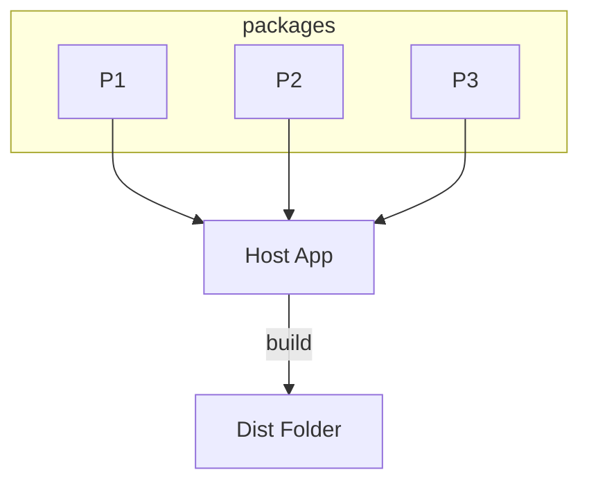
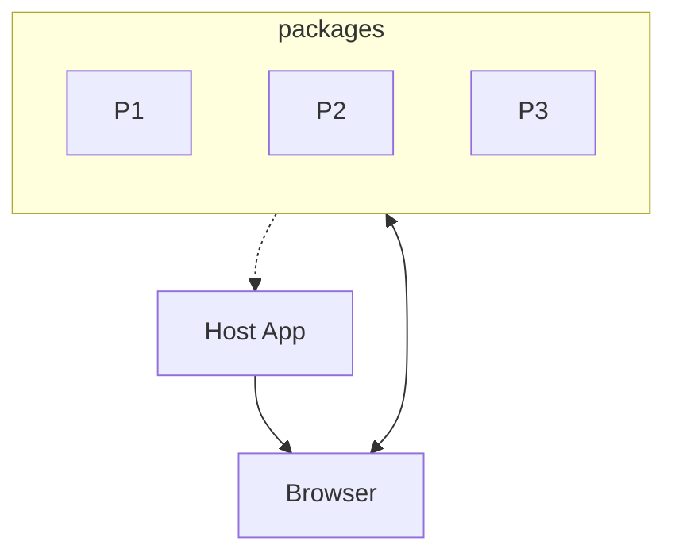

# Micro Front-End 導論

Micro Front-End 定義及作法

---

# 目錄

- 研究目標
- 前端架構的演進
- Micro Front-End 定義
- Micro Front-End 的實作種類
- 我們真的需要 Micro Front-End 嗎？
- 單一專案多框架融合可能性（以 React、Svelte、Solid 為例）

---
layout: center
---

# 研究目標

- 平滑遷移現有專案至新框架可能辦法
- 理解 Micro Front-End 基本構想，同時了解其優缺點

---
layout: cover
---

# 前端架構的演進

Monolith -> Modular Monolith -> Monorepo

---
layout: image-right
image: /assets/monolith.png
backgroundSize: contain
---

# Monolith (單體式)

- 與後端共存
- 通常由後端模版語法生成
- 前端多為附屬品（為後端提供介面操作）
- 與使用者互動性較低

---
layout: image-right
image: /assets/modular-monolith.png
backgroundSize: contain
---

# Modular Monolith (模組化單體式)

- 前端與後端分離
- 整體專案再被細化成多個模組（重複的功能行為及元件）
- 關注點著重於更複雜的互動、系統化的組織樣式、狀態管理及變化
- 多以 SPA 方式運作

---
layout: image-right
image: /assets/monorepo.png
backgroundSize: contain
---

# Monorepo

- 將能夠獨立運作的部分再拆分作個別管理
- 每個部分可獨立開發、測試
- 多團隊共同開發同一專案時可能使用的形式

在開發單一複雜的產品的情境下，重點在多團隊協作要盡可能降低彼此間的影響，所以如何解偶合、定義清楚的介面是關鍵，否則幾乎得不到任何好處

備註：Application 在這裡通常表示能夠獨立運作的商業邏輯區塊

---
layout: center
---

# Micro Front-End

既陌生又高大尚的名詞

---
layout: center
---

# Micro Front-End 的疑問

- Micro Front-End 從何而來？
- Micro Front-End 的定義是什麼？
- Micro Front-End 主要解決什麼問題？

---

# Micro Front-End

1. Micro Front-End 從何而來？

由 Microservices 啟發而來，用同樣的想法套用在前端

2. Micro Front-End 的定義是什麼？

通常指的是將前端拆分成多個獨立的部分，各自能夠獨立**開發、測試、部署**

3. Micro Front-End 主要解決什麼問題？

與 Microservices 相同，將專案從商業邏輯面切分成各個獨立的部分，方便多團隊協作開發及維護

---
layout: two-cols-header
---

# Micro Front-End 的實作種類

::left::

## Buildtime Integration

::right::

## Runtime Integration

---
layout: image-right

image: /assets/buildtime-integration.png
backgroundSize: contain

---

# Buildtime Integration

- 各個部分以 Package 形式存在
- Host App 引入並使用這些 Package
- Host App 負責打包成最終產物

達成 Micro Front-End 的三個條件
- 獨立開發：各個 Package 可專注於自己的功能開發
- 獨立測試：各個 Package 可獨立對自己的部分測試
- 獨立部署：以模組的方式發布給 Host App 引用

---
layout: image-right

image: /assets/runtime-integration.png
backgroundSize: contain

---

# Runtime Integration

- 各個部分以 Package 形式存在
- Package 單獨被發布在伺服器上（CDN）
- Host App 在使用者端會動態載入這些 Package

達成 Micro Front-End 的三個條件
- 獨立開發：各個 Package 可專注於自己的功能開發
- 獨立測試：各個 Package 可獨立對自己的部分測試
- 獨立部署：獨立部屬各個 Package 到線上伺服器上

目前純前端支援的相關工具有 Module Federation、Single SPA

---
layout: center
---

# 兩者的差異

| 特性       | Buildtime Integration | Runtime Integration |
| ---------- | :-------------------: | :-----------------: |
| 開發複雜度 |          低           |         高          |
| 開發體驗   |         普通          |         差          |
| 部署複雜度 |          低           |         高          |
| 載入速度   |          高           |         低          |
| 即時更新   |         不行          |        可以         |