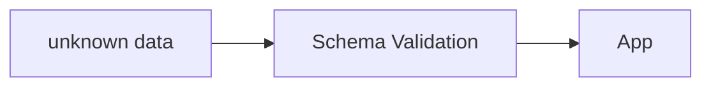

# Type-Driven Development 概述

撰寫一個合適的型別所產生的效益遠比想像的多


---

# 什麼是 Type-Driven Development？
出自於 Type-Driven Development with Idris 這本書

Type-Driven Development 是一種以型別為中心的開發方法，強調在撰寫程式碼之前先定義好資料結構和型別，並利用這些型別來指導程式碼的撰寫和設計。


---

# 理念

為何型別如此重要 ?

- 型別是程式碼的契約，定義了資料的結構和行為
- 編譯器是你的最好的監督者，我們應該盡可能把更多的規則和約束交給編譯器來檢查
- 型別的設計會直接影響程式碼的可讀性和可維護性
- 好的型別設計會促進開發體驗

如果我能用型別盡可能精準表達出所有狀態，那我的程式會大幅減少跑出邊界條件的機會

---

# 型別系統
什麼！靜態型別語言也有分類？

1. 一般靜態型別：Java, C#, Go, TypeScript
2. 表達力較強的型別系統：Haskell, Rust, Scala
3. 依值型別系統：Idris, Agda, Rocq, Lean

---

# 型別能表達什麼？

同樣是靜態型別，型別可以承載的資訊有深有淺，承載的資訊越精確，編譯器越能在開發期間替我們排除不合理的程式。

<v-switch>
<template #1>

### 原始資料

- `number`
- `string`
- `boolean`
- `null`
- `undefined`
- `symbol`
- `bigint`
- ...

</template>

<template #2>

### 有限集合

```ts
type Color = 'red' | 'green' | 'blue';

type Week = 'Mon' | 'Tue' | 'Wed' | 'Thu' | 'Fri' | 'Sat' | 'Sun';

type Currency = 'USD' | 'EUR' | 'JPY' | 'GBP';

```

</template>

<template #3>

### 格式約束

```ts
type Px = `${number}px`;

type Percentage = `${number}%`;

type RgbColor = `rgb(${number}, ${number}, ${number})`;
```

</template>

<template #4>

### 結構

```ts
interface User {
  id: number;
  name: string;
}

type Rgb = [number, number, number]


```

</template>

<template #5>

### 分支(discriminated union)

```ts
type Result<T, E> =
  | { type: 'success'; value: T }
  | { type: 'error'; error: E };

type Shape =
  | { type: 'circle'; radius: number }
  | { type: 'rectangle'; width: number; height: number }
  | { type: 'triangle'; base: number; height: number };
```

</template>

<template #6>

### 可依賴實際值的型別

```lean
-- example.lean

inductive Vect (α : Type u) : Nat → Type u where
   | nil : Vect α 0
   | cons : α → Vect α n → Vect α (n + 1)

def zero: Vect Nat 0 := Vect.nil

def one: Vect Nat 1 := Vect.cons 0 zero

def two: Vect Nat 2 := Vect.cons 0 one
```

型別系統會算數！

</template>
</v-switch>

---
layout: intro
---
# 回到 TypeScript

型別系統足夠用即可

雖然越高階的型別系統能表達更多的資訊，但也意味著設計難度更大，學習曲線更陡峭，所以語言選擇只是一個權衡的結果。

---

# 型別確實影響著你開發

那些第三方函式庫對型別的用心程度會直接影響到你的開發體驗

- Tanstack Query (利用分支型別表達出不同狀態的資料結構，讓你在使用的過程中不會誤用不合法內容)
- Zod (除了能對資料結構進行驗證，並且能夠從驗證的結果中推斷出更精確的型別)
- Effect-TS (盡可能的利用型別精確的表達函數的結果及副作用)
- ElysiaJS (利用型別表達出 API 的參數，讓你能夠明確的操作 API 的內容)

有時會因為型別而被迫進行繁瑣判斷，但這也恰恰達到了 Type-Driven Development 的目的，讓你在開發過程中不會誤用不合法的內容，而且你無法偷懶。

---

# 如何實踐

轉變你的開發思維

1. 確定這個函數你想做什麼
2. 先不要被怎麼實作的問題綁住
3. 定義輸入輸出型別
4. 依據型別來實作函數

優先以人類覺得最正確的邏輯對型別進行建模，無法精確表達通常是型別~~玩不夠花~~，或是已經觸碰到語言的限制了。

---

# 實作範例

自定義 fetch type

<v-switch>
  <template #1> 格式約束 </template>
  <template #2> 結構、有限集合、泛型 </template>
  <template #3> 分支(discriminated union) </template>
  <template #4> 泛型約束 </template>
  <template #5> 函數多載 </template>
</v-switch>


````md magic-move {at: 1}
```ts
type Fetch = (api: string) => (query?: unknown) => Promise<unknown>
```

```ts
type ApiPath = `api/${string}`

type Fetch = (api: ApiPath) => (query?: unknown) => Promise<unknown>
```

```ts
type ApiPath = `api/${string}`

type Resp<T, E> = {
  statusCode: number;
  status: 'success' | 'error';
  data?: T;
  error?: E
}

type Fetch = <T, E>(api: ApiPath) => (query?: unknown) => Promise<Resp<T, E>>
```

```ts
type ApiPath = `api/${string}`

type Resp<T, E> =
  | {
      statusCode: 200;
      status: 'success';
      data: T;
    }
  | {
      statusCode: number;
      status: 'error';
      error: E;
    };

type Fetch = <T, E>(api: ApiPath) => (query?: unknown) => Promise<Resp<T, E>>
```

```ts
type ApiPath = `api/${string}`

type Resp<T, E> =
  | {
      statusCode: 200;
      status: 'success';
      data: T;
    }
  | {
      statusCode: number;
      status: 'error';
      error: E;
    };

type Fetch = <T, E, Q extends object>(api: ApiPath) => (query?: Q) => Promise<Resp<T, E>>
```

```ts
type ApiPath = `api/${string}`

type Resp<T, E> =
  | {
      statusCode: 200;
      status: 'success';
      data: T;
    }
  | {
      statusCode: number;
      status: 'error';
      error: E;
    };

interface Fetch {
  <T, E, Q extends object>(api: ApiPath): (query: Q) => Promise<Resp<T, E>>
  <T, E>(api: ApiPath): () => Promise<Resp<T, E>>
}
```
````

---

# 型別的設計會改變開發行為

小小用心，大大改變

<v-switch>
  <template #0> 
  
  好的型別不是讓你少寫判斷，而是讓你不能跳過必要判斷。

  ```ts
  declare const request: Fetch;

  const resp = await request<User, ApiError>('api/users')();

  renderUser(resp.data);
  //              ^^^^
  // Property 'data' does not exist on type 'Resp<User, ApiError>'
  ```

  型別告訴你：這個資料還不能被當成成功結果使用。

  </template>
  <template #1> 
  
  當你先處理分支，TypeScript 才會把型別收斂到正確的狀態。

  ```ts
  declare const request: Fetch;

  const resp = await request<User, ApiError>('api/users')();

  if (resp.status === 'success') {
    renderUser(resp.data);
  } else {
    showError(resp.error);
  }
  ```

  在源頭能保證實作正確性的情況下，即便這個判斷稍微囉唆一點，但從使用安全性角度來看，能在維護與開發當下讓開發者意識到實際會發生的狀況，半強迫式的引導開發者主動選擇如何處置。
  
  </template>
</v-switch>

---

# 避免不可能狀態

型別設計的重點不只是描述資料長相，而是限制不合理的組合。

<v-switch>
  <template #0>

  ```ts
  type QueryState = {
    loading: boolean;
    data?: User;
    error?: Error;
  };
  ```

  這樣的型別看起來彈性很高，但也代表它允許很多不合理的狀態。

  ```ts
  const state: QueryState = {
    loading: true,
    data: user,
    error: error,
  };
  ```

  </template>
  <template #1>

  ```ts
  type QueryState =
    | { status: 'idle' }
    | { status: 'loading' }
    | { status: 'success'; data: User }
    | { status: 'error'; error: Error };
  ```

  每個狀態只攜帶它真正會有的資訊。

  ```ts
  if (state.status === 'success') {
    renderUser(state.data);
  }
  ```

  </template>
</v-switch>

---

# 把規則放到對的位置

Type Driven Development 不是把所有規則都塞進型別，而是判斷每個規則應該在哪裡被保證。

```ts
type ApiPath = `api/${string}`;
// static: 可以交給型別系統

const user = UserSchema.parse(raw);
// boundary: 外部資料進來時驗證

await canAccess(currentUser, resource);
// runtime: 依賴資料庫、時間、權限或外部系統
```

型別能保證的，就讓編譯器幫你守住；型別保證不了的，就把檢查集中在明確的邊界。

---
layout: image-right

# the image source
image: ./assets/fortress.png
backgroundSize: cover
---

# 你的程式就像一座堡壘

資料必須經過層層關卡才能真正進到某個區域（函數）內被運用

程式就是一個透過小型函數慢慢拼湊組合而成的超大函數，每個函數都有一個明確的目的，型別則是這些函數的守衛，確保只有合法的資料能通過關卡進入函數內部被運用。


程式最外層基本的防禦手段




---

# 其他高階應用的型別

高階型別不是為了炫技，而是把「已經成立的規則」留在型別裡，讓後續程式不能忘記。

<v-switch>
  <template #0> Brand Type：替驗證過的資料蓋章 </template>
  <template #1> Conditional Type：型別層級的 if </template>
  <template #2> 從 Route 推導 Params </template>
</v-switch>

````md magic-move {at: 1}
```ts
declare const brand: unique symbol;

type Brand<T, Name extends string> = T & {
  readonly [brand]: Name;
};

type UserId = Brand<string, "UserId">;
type ProductId = Brand<string, "ProductId">;

function parseUserId(raw: string): UserId | null {
  return /^user_[a-z0-9]+$/.test(raw) ? (raw as UserId) : null;
}

function getUser(id: UserId) {}

getUser("user_123");
//      ^ string 還不是 UserId
```

```ts
type ApiResponse<T> =
  | { ok: true; data: T }
  | { ok: false; error: string };

type SuccessData<T> =
  T extends { ok: true; data: infer Data }
    ? Data
    : never;

type UserResponse = ApiResponse<{
  id: string;
  name: string;
}>;

type User = SuccessData<UserResponse>;
// { id: string; name: string }
```

```ts
type ExtractRouteParams<Path extends string> =
  Path extends `${string}:${infer Param}/${infer Rest}`
    ? Param | ExtractRouteParams<Rest>
    : Path extends `${string}:${infer Param}`
      ? Param
      : never;

type RouteParams<Path extends string> = {
  [Key in ExtractRouteParams<Path>]: string;
};

type Params = RouteParams<"/users/:userId/posts/:postId">;
// { userId: string; postId: string }
```
````

<v-switch at="1">
  <template #0>
    <span>資料在 boundary 被驗證後，Brand Type 讓它在型別系統中留下「可信身份」。</span>
  </template>
  <template #1>
    <span>Conditional Type 可以描述輸入型別與輸出型別的關係，常用來從既有型別抽出資訊。</span>
  </template>
  <template #2>
    <span>高階型別最有價值的地方，是讓 API 從單一來源自動推導，減少手動同步造成的不一致。</span>
  </template>
</v-switch>
